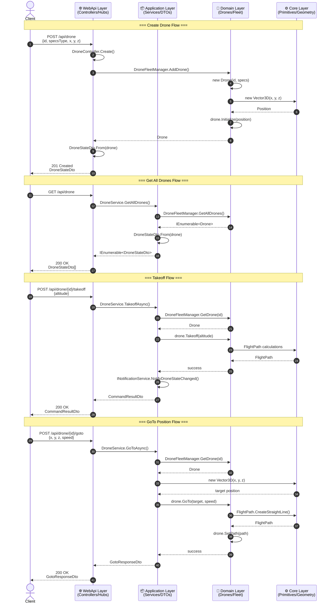
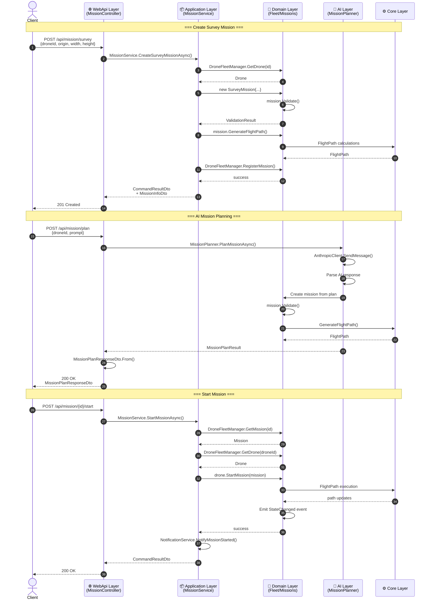
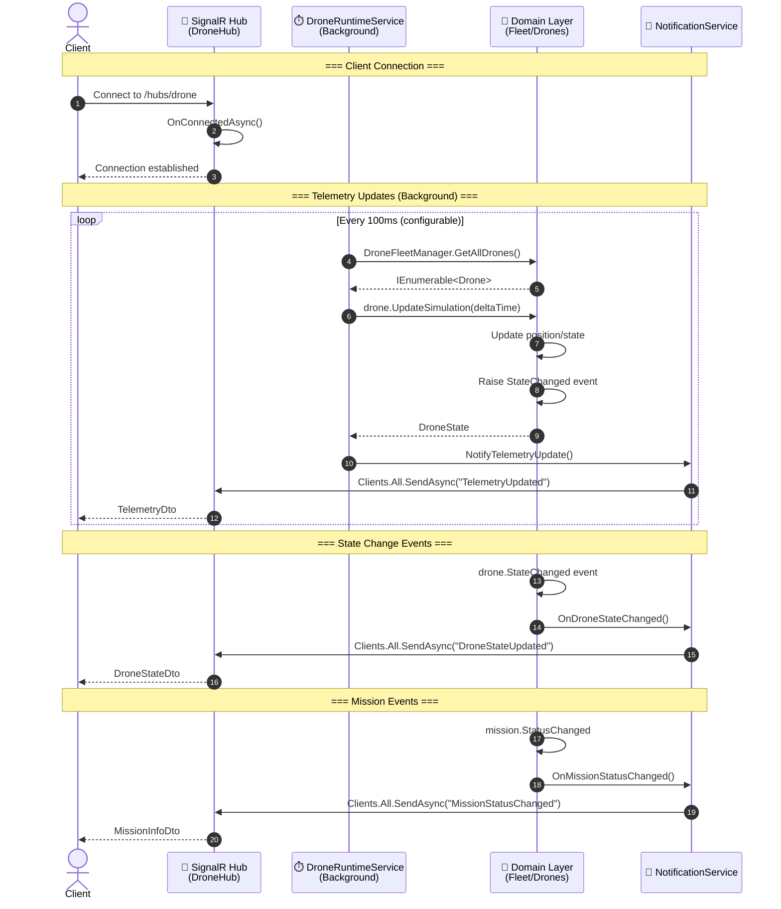
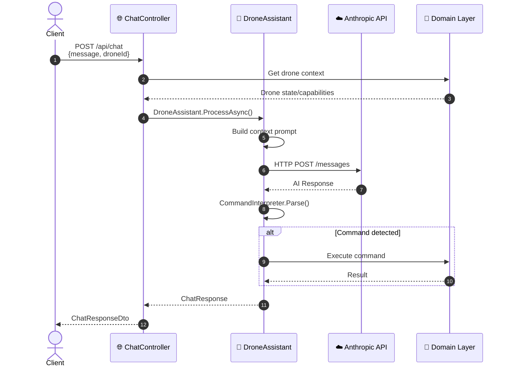
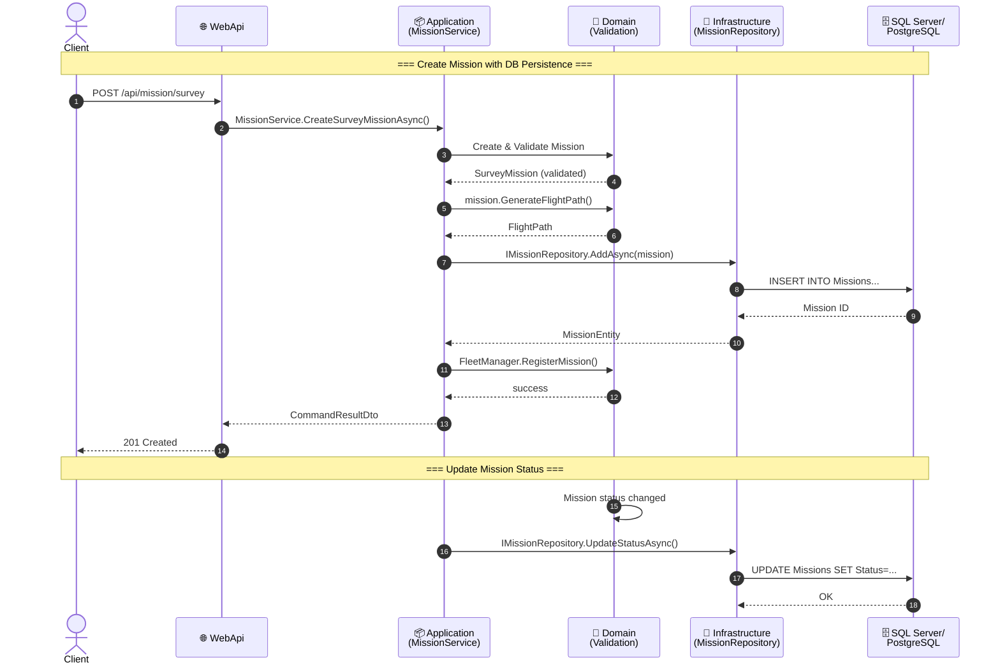
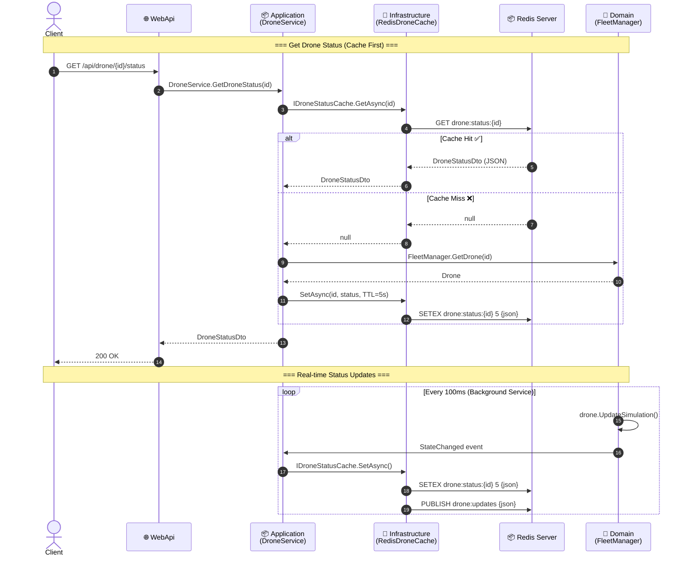
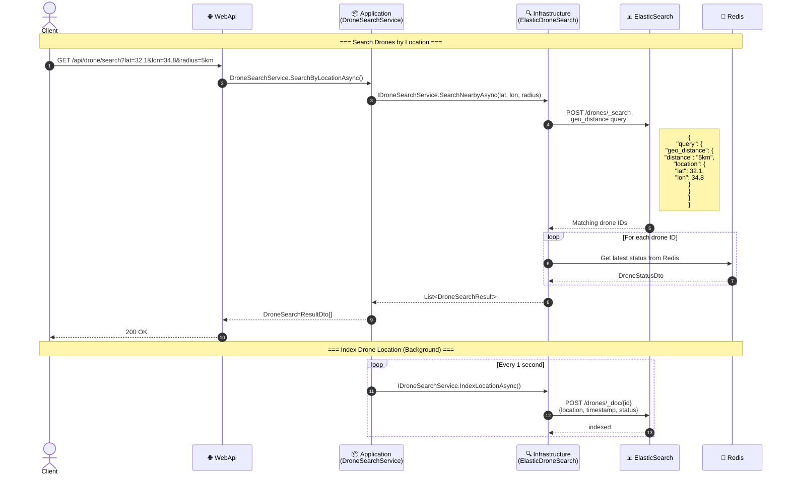

# GIS3DEngine - Sequence Diagram (Layered Architecture)

## Project Layers Overview

```
┌─────────────────────────────────────────────────────────────────────┐
│                        Presentation Layer                           │
│                      (GIS3DEngine.WebApi)                           │
│         Controllers, Hubs, SignalR, HTTP/REST Endpoints             │
└─────────────────────────────────────────────────────────────────────┘
                                  │
                                  ▼
┌─────────────────────────────────────────────────────────────────────┐
│                        Application Layer                            │
│                    (GIS3DEngine.Application)                        │
│      Services, DTOs, Interfaces, Business Logic Orchestration       │
└─────────────────────────────────────────────────────────────────────┘
                                  │
                                  ▼
┌─────────────────────────────────────────────────────────────────────┐
│                         Domain Layer                                │
│              (GIS3DEngine.Drones + GIS3DEngine.Services)            │
│     Fleet Management, Missions, AI, Telemetry, Domain Logic         │
└─────────────────────────────────────────────────────────────────────┘
                                  │
                                  ▼
┌─────────────────────────────────────────────────────────────────────┐
│                          Core Layer                                 │
│                       (GIS3DEngine.Core)                            │
│       Primitives, Geometry, Flights, Spatial, Interfaces            │
└─────────────────────────────────────────────────────────────────────┘
```

---

## Sequence Diagram - Drone Operations



---

## Sequence Diagram - Mission Operations



---

## Sequence Diagram - Real-time Updates (SignalR)



---

## Sequence Diagram - Chat/AI Assistant



---

## Layer Dependencies

```
GIS3DEngine.WebApi
    ├── GIS3DEngine.Application
    ├── GIS3DEngine.Drones
    ├── GIS3DEngine.Services
    ├── GIS3DEngine.Core
    └── GIS3DEngine.ServiceDefaults

GIS3DEngine.Application
    ├── GIS3DEngine.Drones
    └── GIS3DEngine.Core

GIS3DEngine.Drones
    └── GIS3DEngine.Core

GIS3DEngine.Services
    ├── GIS3DEngine.Drones
    └── GIS3DEngine.Core

GIS3DEngine.Core
    └── (No dependencies - Base layer)
```

---

## Key Components per Layer

| Layer | Project | Key Components |
|-------|---------|----------------|
| **Presentation** | WebApi | `DroneController`, `MissionController`, `ChatController`, `DroneHub` |
| **Application** | Application | `DroneService`, `MissionService`, `IDroneService`, `IMissionService`, DTOs |
| **Domain** | Drones | `DroneFleetManager`, `Drone`, `DroneMission`, `MissionPlanner`, `AnthropicClient` |
| **Domain** | Services | `AiMissionPlannerAdapter` |
| **Core** | Core | `Vector3D`, `FlightPath`, `FlyingObject`, `Polygon2D`, `Polygon3D` |

---

## 🆕 Proposed Infrastructure Layer

### Architecture with DB, Redis & ElasticSearch

```
┌─────────────────────────────────────────────────────────────────────┐
│                        Presentation Layer                           │
│                      (GIS3DEngine.WebApi)                           │
└─────────────────────────────────────────────────────────────────────┘
                                  │
                                  ▼
┌─────────────────────────────────────────────────────────────────────┐
│                        Application Layer                            │
│                    (GIS3DEngine.Application)                        │
│     Services use Interfaces (IMissionRepository, IDroneCache, etc)  │
└─────────────────────────────────────────────────────────────────────┘
                                  │
          ┌───────────────────────┼───────────────────────┐
          ▼                       ▼                       ▼
┌───────────────────┐ ┌───────────────────┐ ┌───────────────────────┐
│   Domain Layer    │ │Infrastructure Layer│ │  Infrastructure Layer │
│   (Drones/Core)   │ │  (Persistence)     │ │  (Caching/Search)     │
│                   │ │                    │ │                       │
│  Business Logic   │ │  ✅ SQL Server/    │ │  ✅ Redis - Status    │
│  Mission Rules    │ │     PostgreSQL     │ │  ✅ ElasticSearch -   │
│  Flight Calcs     │ │  ✅ EF Core        │ │     Location Search   │
└───────────────────┘ └───────────────────┘ └───────────────────────┘
```

---

## 📦 New Project: GIS3DEngine.Infrastructure

### Recommended Structure:

```
GIS3DEngine.Infrastructure/
├── Persistence/
│   ├── GIS3DEngineDbContext.cs           # EF Core DbContext
│   ├── Configurations/
│   │   ├── MissionConfiguration.cs        # EF Fluent API
│   │   └── DroneConfiguration.cs
│   └── Repositories/
│       ├── MissionRepository.cs           # IMissionRepository impl
│       └── DroneRepository.cs             # IDroneRepository impl
│
├── Caching/
│   ├── RedisDroneStatusCache.cs           # IDroneStatusCache impl
│   └── RedisConnectionFactory.cs
│
├── Search/
│   ├── ElasticDroneSearchService.cs       # IDroneSearchService impl
│   └── ElasticSearchConfiguration.cs
│
└── DependencyInjection.cs                 # Extension methods
```

---

## Sequence Diagram - Mission DB Persistence



---

## Sequence Diagram - Redis Drone Status



---

## Sequence Diagram - ElasticSearch Location Search



---

## Interfaces to Add in Application Layer

```csharp
// GIS3DEngine.Application/Interfaces/IMissionRepository.cs
public interface IMissionRepository
{
    Task<MissionEntity?> GetByIdAsync(string id);
    Task<IEnumerable<MissionEntity>> GetByDroneIdAsync(string droneId);
    Task<IEnumerable<MissionEntity>> GetAllAsync();
    Task<MissionEntity> AddAsync(MissionEntity mission);
    Task UpdateStatusAsync(string id, MissionStatus status);
    Task DeleteAsync(string id);
}

// GIS3DEngine.Application/Interfaces/IDroneStatusCache.cs
public interface IDroneStatusCache
{
    Task<DroneStatusDto?> GetAsync(string droneId);
    Task SetAsync(string droneId, DroneStatusDto status, TimeSpan? ttl = null);
    Task RemoveAsync(string droneId);
    Task<IEnumerable<DroneStatusDto>> GetAllAsync();
}

// GIS3DEngine.Application/Interfaces/IDroneSearchService.cs
public interface IDroneSearchService
{
    Task<IEnumerable<DroneSearchResult>> SearchNearbyAsync(
        double latitude, double longitude, double radiusKm);
    Task<IEnumerable<DroneSearchResult>> SearchByStatusAsync(DroneStatus status);
    Task<IEnumerable<DroneSearchResult>> SearchByMissionTypeAsync(string missionType);
    Task IndexLocationAsync(string droneId, double lat, double lon, DroneStatus status);
}
```

---

## Updated Layer Dependencies

```
GIS3DEngine.WebApi
    ├── GIS3DEngine.Application
    ├── GIS3DEngine.Infrastructure  ← 🆕 Register DI services
    └── GIS3DEngine.ServiceDefaults

GIS3DEngine.Application
    ├── GIS3DEngine.Drones
    ├── GIS3DEngine.Core
    └── (Interfaces only - no infra dependencies)

GIS3DEngine.Infrastructure  ← 🆕
    ├── GIS3DEngine.Application (for interfaces)
    ├── GIS3DEngine.Core
    ├── Microsoft.EntityFrameworkCore.SqlServer
    ├── StackExchange.Redis
    └── NEST (ElasticSearch client)

GIS3DEngine.Drones
    └── GIS3DEngine.Core

GIS3DEngine.Core
    └── (No dependencies)
```

---

## Summary: Where Each Technology Belongs

| Technology | Layer | Purpose | Interface |
|------------|-------|---------|-----------|
| **SQL Server/PostgreSQL** | Infrastructure | Mission persistence, History | `IMissionRepository` |
| **Redis** | Infrastructure | Real-time drone status cache | `IDroneStatusCache` |
| **ElasticSearch** | Infrastructure | Geo-location search | `IDroneSearchService` |

### Data Flow:
1. **Write Path**: Domain → Application → Infrastructure → External Service
2. **Read Path**: Client → WebApi → Application → Cache/Search → (fallback to Domain)
